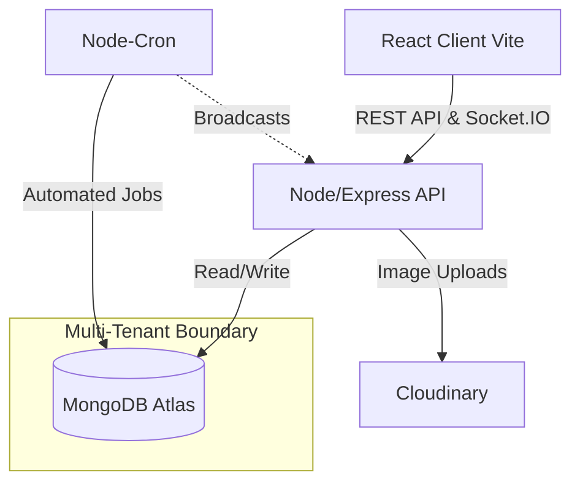

# SiteSafe - Multi-Tenant Incident Management

SiteSafe is an enterprise-grade, multi-tenant workplace incident and corrective-action tracker. Designed for safety compliance, it provides a strict FSM workflow, granular RBAC (Role-Based Access Control), real-time notifications via WebSockets, and comprehensive auditability.

## 🏗️ Architecture



### Core Technologies
*   **Frontend:** React (Vite), Redux Toolkit, Material UI, Recharts, React-i18next, Socket.io-client.
*   **Backend:** Node.js, Express, Mongoose, Zod, Socket.IO, node-cron.
*   **Security:** JWT (httpOnly cookies), bcrypt, Helmet, Rate Limiting, CORS.
*   **DevOps:** Docker Compose, GitHub Actions.

## 🚀 Setup & Local Development

### Prerequisites
*   Node.js v20+
*   MongoDB Instance (Local or Atlas)
*   Cloudinary Account

### 1. Environment Configuration
Create a `.env` file in the `/server` directory:
```env
PORT=5000
NODE_ENV=development
MONGODB_URI=your_mongodb_uri
JWT_ACCESS_SECRET=your_super_secret_key_1
JWT_REFRESH_SECRET=your_super_secret_key_2
CLIENT_URL=http://localhost:5173
CLOUDINARY_CLOUD_NAME=your_cloud_name
CLOUDINARY_API_KEY=your_api_key
CLOUDINARY_API_SECRET=your_api_secret
```

Create a `.env` file in the `/client` directory (optional, defaults are set):
```env
VITE_API_URL=http://localhost:5000/api
```

### 2. Run with Docker Compose (Easiest)
```bash
docker-compose up --build
```
This will start MongoDB, the Node Backend (Port 5000), and the Nginx Frontend (Port 5173).

### 3. Run Manually
**Backend:**
```bash
cd server
npm install
npm run dev
```

**Frontend:**
```bash
cd client
npm install
npm run dev
```

### 4. Seed Database
To populate the database with a demo organization and users for every role (`reporter`, `safety_officer`, `manager`, `admin`):
```bash
cd server
node scripts/seed.js
```
*All seeded users have the password `password123`.*

## ☁️ Deployment

### Deploying the Client to Vercel
1. Push your repository to GitHub.
2. Log into Vercel and import the project.
3. Set the Root Directory to `client`.
4. Add the Environment Variable: `VITE_API_URL=https://your-render-backend-url.com/api`
5. Click **Deploy**. Vercel will automatically run `npm run build` using the Vite config.

### Deploying the API to Render
1. In the Render Dashboard, click **New Web Service**.
2. Connect your GitHub repository and set the Root Directory to `server`.
3. Build Command: `npm install`
4. Start Command: `npm start`
5. Add all your Environment Variables (MongoDB, Cloudinary, JWT secrets).
6. Click **Create Web Service**.

## 🧠 Design Decisions & Interview Notes

*   **Multi-Tenancy (Siloed Data):** Instead of creating physical databases per tenant (which doesn't scale well), we use a logical multi-tenancy approach. Every schema includes an `orgId`. Crucially, we enforce this at the *Controller* level on every query (e.g., `Incident.find({ orgId: req.user.orgId })`). This explicit injection prevents accidental cross-tenant data leakage that can occur when relying on implicit global plugins.
*   **Security (httpOnly Cookies):** JWT Access and Refresh tokens are delivered via `httpOnly` cookies rather than local storage. This renders the application immune to XSS token-theft attacks. Cross-Origin Socket.IO handshakes are authorized by parsing this secure cookie using `withCredentials: true`.
*   **Database Optimization (ESR Rule):** The Incident collection utilizes a compound index on `{ orgId: 1, status: 1, createdAt: -1 }`. Following the Equality, Sort, Range (ESR) rule, this perfectly satisfies our list endpoint's requirement to filter by tenant and status, sort chronologically, and paginate using `createdAt` as a cursor—without scanning unnecessary documents.
*   **Finite State Machine (FSM):** Incident status transitions are strictly guarded by a server-side transition map (`reported -> investigating -> action_pending -> closed`). This prevents malicious or accidental API calls from skipping crucial investigative steps, ensuring compliance integrity.
*   **Stateless Uploads:** We avoid saving uploaded files to local disk, as modern cloud hosts (Render, Heroku) use ephemeral filesystems. Instead, `multer.memoryStorage()` holds the file in RAM, and `streamifier` pipes it directly into Cloudinary's upload stream.
